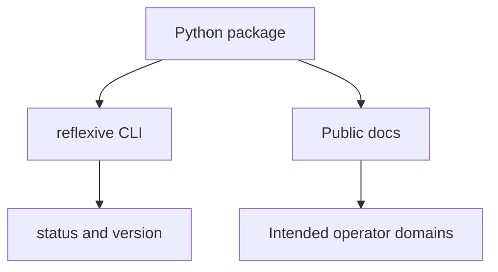

# Architecture

`reflexive` is an operator-safety CLI. Its public release currently consists of
a small installable command-line shell plus documentation describing the broader
operator-safety direction of the project.

## Current public release

The shipped public surface currently has three parts:

- an installable Python package
- a minimal CLI entrypoint with `status` and `version`
- public-facing docs that describe the intended operator-safety model

## Intended operator domains

The broader design centers on two command domains:

- `cortex`: inspection, snapshots, recovery surfaces, and isolated runtime
  environments
- `scaffold`: documentation and guardrail-oriented repository surfaces that
  shape safer operator workflows

## Design intent

- Keep risky state-changing actions explicit.
- Prefer inspectable snapshots and recovery flows over hidden mutation.
- Separate disposable experimentation from durable recovery state.
- Keep documentation and operator guardrails close to the tool instead of
  relying on tribal knowledge.

## Diagram source

The diagram source lives in [architecture.mmd](architecture.mmd).
