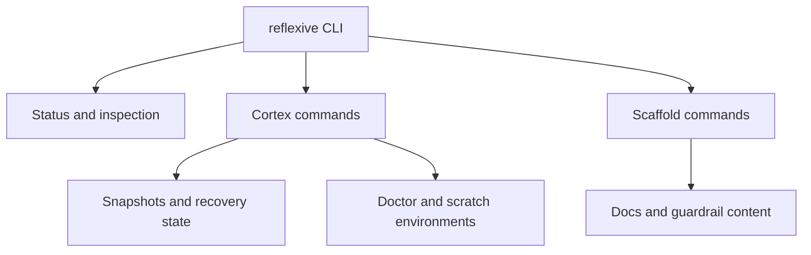

# Architecture

`reflexive` is an operator-safety CLI. It separates direct tool-state work from
the surrounding documentation and guardrail surface so risky recovery actions
are explicit and inspectable.

## Public model

The project currently centers on two command domains:

- `cortex`: inspection, snapshots, recovery surfaces, and isolated runtime
  environments
- `scaffold`: documentation and guardrail-oriented repo surfaces that shape
  safer operator workflows

## Design intent

- Keep risky state-changing actions explicit.
- Prefer inspectable snapshots and recovery flows over hidden mutation.
- Separate disposable experimentation from durable recovery state.
- Keep documentation and operator guardrails close to the tool instead of
  relying on tribal knowledge.

## Diagram source

The diagram source lives in [architecture.mmd](architecture.mmd).
