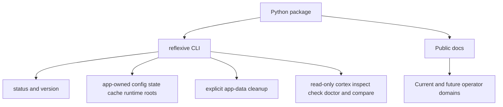

# Architecture

`reflexive` is an operator-safety CLI. Its public release currently consists of
a small installable command-line package with app-owned path discovery, explicit
cleanup, read-only inspection commands, and public documentation describing the
broader operator-safety direction of the project.

## Current public release

The shipped public surface currently has three parts:

- an installable Python package
- a public CLI entrypoint with release metadata, app-owned path management, and read-only operator commands
- public-facing docs that describe the intended operator-safety model

## Current public domains

The current public release exposes:

- release metadata commands
- app-owned config, state, cache, and runtime path discovery
- explicit app-data purge
- read-only `cortex` inspection, risk-check, recommendation, and comparison commands for explicit paths
- app-owned machine-local snapshots for explicit paths
- app-owned snapshot verification and diff for explicit paths

## Deferred operator domains

The broader design still includes richer operator domains, but they are not yet
part of public `main`:

- doctor and scratch environment staging
- restore workflows
- scaffold commands for documentation and guardrail-oriented repository surfaces

## App-state posture

Mutable state intended for future public workflows should live under app-owned
XDG-style roots rather than inside the repo checkout. Cleanup is explicit via
the CLI, not implicit during package uninstall.

## Design intent

- Keep risky state-changing actions explicit.
- Prefer inspectable snapshots and recovery flows over hidden mutation.
- Separate disposable experimentation from durable recovery state.
- Keep documentation and operator guardrails close to the tool instead of
  relying on tribal knowledge.

## Diagram source

The diagram source lives in [architecture.mmd](architecture.mmd).
