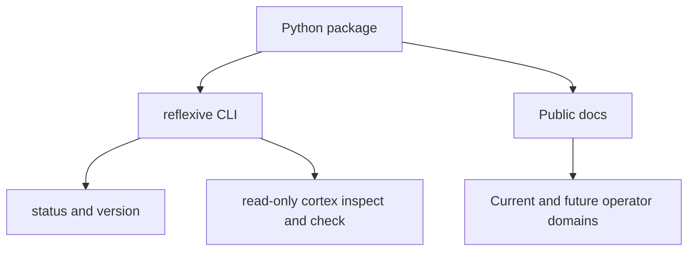

# Architecture

`reflexive` is an operator-safety CLI. Its public release currently consists of
a small installable command-line package with read-only inspection commands and
public documentation describing the broader operator-safety direction of the
project.

## Current public release

The shipped public surface currently has three parts:

- an installable Python package
- a read-only CLI entrypoint with release metadata plus filesystem inspection
- public-facing docs that describe the intended operator-safety model

## Current public domains

The current public release exposes:

- release metadata commands
- read-only `cortex` inspection and risk-check commands for explicit paths

## Deferred operator domains

The broader design still includes richer operator domains, but they are not yet
part of public `main`:

- state-changing `cortex` snapshot and recovery workflows
- doctor and scratch environment staging
- scaffold commands for documentation and guardrail-oriented repository surfaces

## Design intent

- Keep risky state-changing actions explicit.
- Prefer inspectable snapshots and recovery flows over hidden mutation.
- Separate disposable experimentation from durable recovery state.
- Keep documentation and operator guardrails close to the tool instead of
  relying on tribal knowledge.

## Diagram source

The diagram source lives in [architecture.mmd](architecture.mmd).
